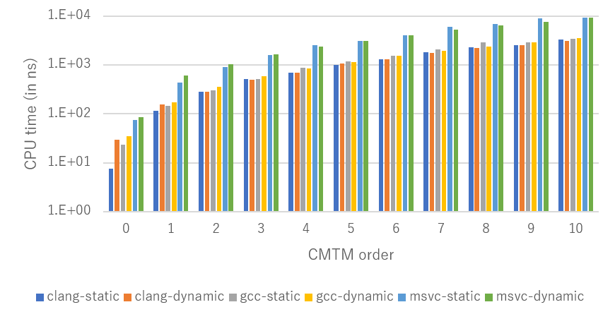
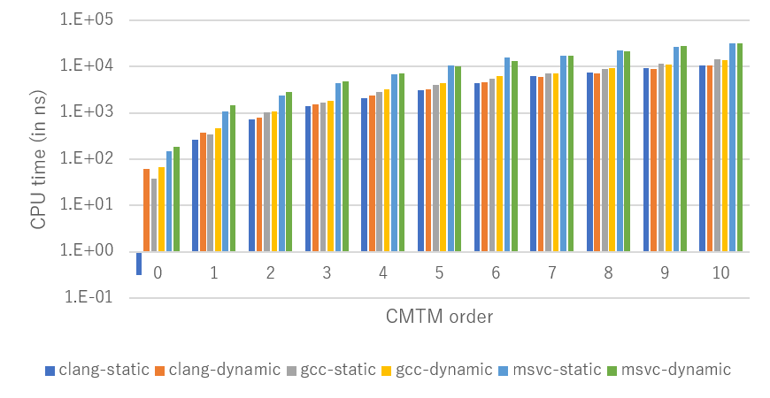

# COMA

The comprehensive motion algebra (COMA) library is a header-only c++ implementation of the Comprehensive Motion Transformation Matrix (CMTM)
along the needed lie algebra tools.

## Table of contents
 1. [Installation](#Installation)
 2. [Performance](#Performance)
 3. [Reference](#Reference)

## Installation

Currently, you can only download it from github.
As a header-only library, one way to use the lib is to copy-paste the include directory.
Otherwise, you can proceed as follow.

### Dependencies

To compile you need the following tools:

 * [Git]()
 * [CMake]() >= 3.8.2
 * [doxygen]()
 * [g++]() >= 8.3 (for C++17 support)
 * [Eigen](http://eigen.tuxfamily.org/index.php?title=Main_Page) >= 3.2

For benchmarks:

 * [benchmark](https://github.com/google/benchmark)

### Building

```sh
git clone --recursive https://github.com/vsamy/coma
cd coma
mkdir build
cd build
cmake [options] ..
make -j8 && make install
```

### CMake options

You can set `BUILD_TESTING` to `ON/OFF` to enable/disable test building.
You can set `BUILD_EXAMPLE` to `ON/OFF` to enable/disable example building.
You can set `BUILD_BENCH` to `ON/OFF` to enable/disable benchmark building.

## Performance

Here are some benchmarks made with google benchmarks and a i7-7700HQ@2.80GHz.
GCC and Clang tests have been made under WSL2.

The next graph is a multiplication between two CMTM.
Static corresponds to `CMTM<double, 6, order>` and dynamic to `CMTM<double, 6, coma::Dynamic>`.



The next graph is a multiplication between two CMTM that also consider the construction of the two CMTM matrices and the deconstruction of the result.
Static corresponds to `CMTM<double, 6, order>` and dynamic to `CMTM<double, 6, coma::Dynamic>`.



## Reference

Related paper can be found [here](https://roboticsconference.org/program/papers/032/)

Citation
```bibtex
@inproceedings{samy2021generalized,
  title={Generalized Comprehensive Motion Theory for High-Order Differential Dynamics},
  author={Samy, Vincent and Ayusawa, Ko and Yoshida, Eiichi},
  journal={Robotics: Science and Systems XVII},
  year={2021}
}
```